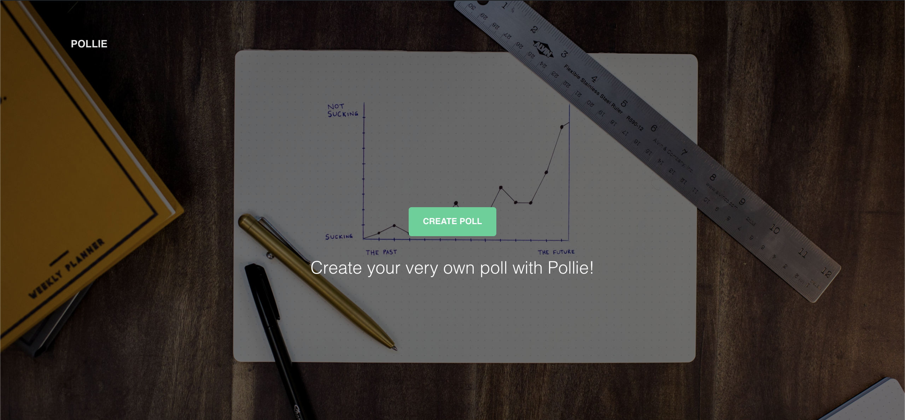
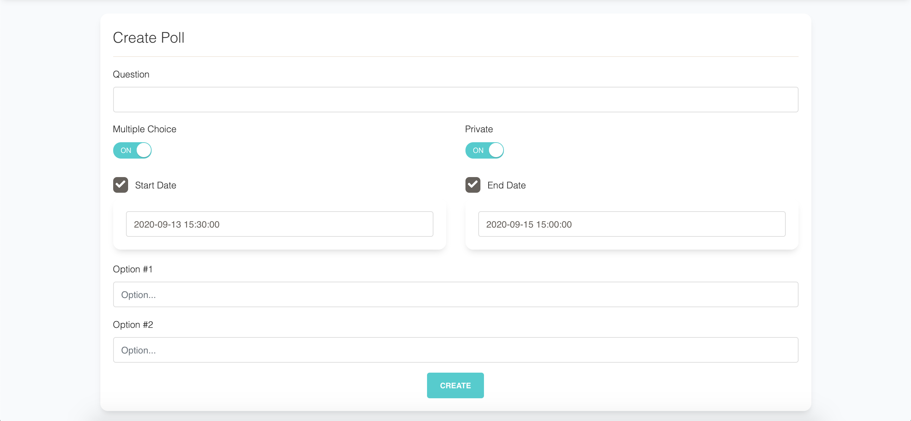
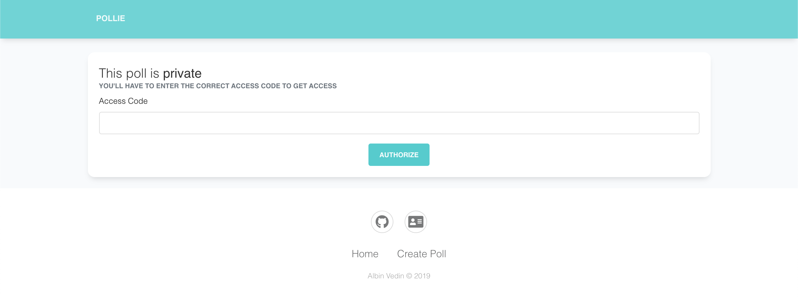
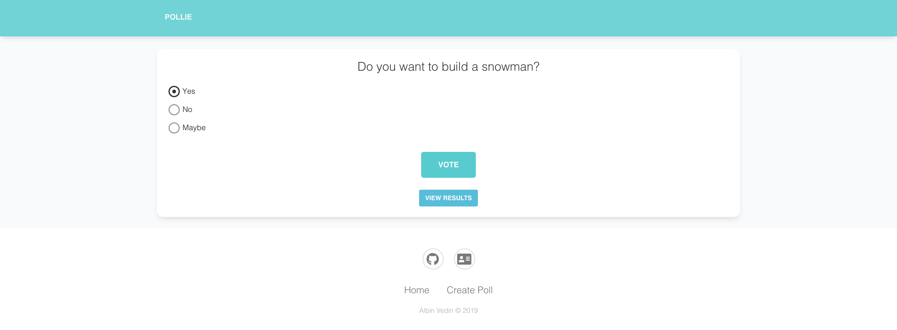
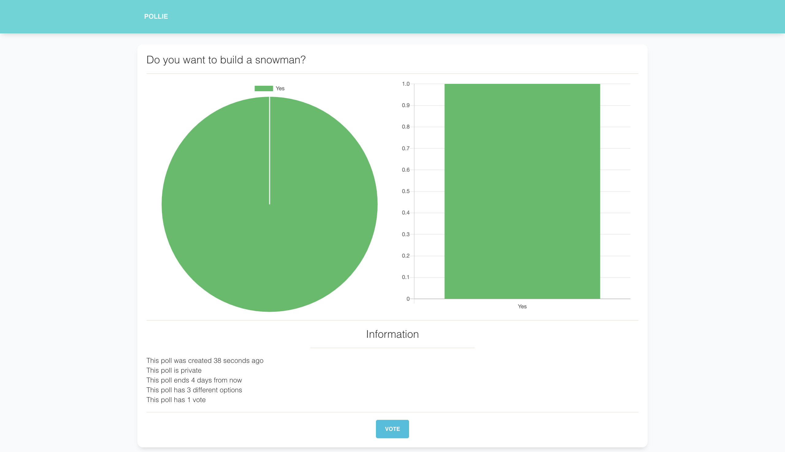

### :warning: NOTE :warning:

This is not a finished product, and is unmaintained.

# Pollie

A simple yet effective platform to create polls that can be shared with whomever.

## Features
* Set a start- & stop-date for your polls :date:
* Make your poll private, requiring users to provide a password to vote :closed_lock_with_key:
* Enable or disable multiple choice :pencil2:
* Fingerprint used for detecting if a user has already voted :raised_hands:

## Stack
Laravel, Vue, Chart.js, Fingerprint2, Bootstrap, SCSS & Paperkit.

## Images

#### Main Page

#### Create Page

#### Authorize Page

#### Vote Page

#### Result Page

